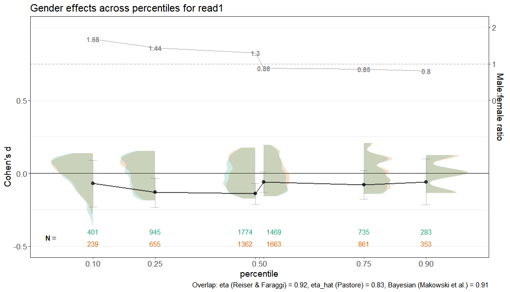

# genderplot
Introduction
============

The [**genderplot**](http:://github.com/Christian-T/genderplot) package
provides more informative plots to investigate gender effects.
The reasons behind it are described in the paper Thurn, Braas, Berkowitz (in preparation).




Installation
------------

``` r
library(devtools)
devtools::install_github("Christian-T/genderplot", force = TRUE)
library(genderplot)
```

The gender_plot function will need a column named "*gender*". If your column is named differently, specify `gender = "name_of_gender_column"`. The function checks whether the column contains values with the levels "*female/male*". If the levels are different (e.g., "*f/m*") the function will make use of the `recode_gender` function from the `gendercodeR` package. You can install it via  `devtools::install_github('ropenscilabs/gendercodeR')`, or you provide a gender column with levels labelled "*female*" and "*male*".

Examples
================

``` r
library(AER)
data("PhDPublications")

genderplot::gender_plot(PhDPublications, varname="prestige")
genderplot::gender_plot(PhDPublications, varname="prestige", lb=-1) #need to adjust lower bound
# to depict larger gender differences

data(STAR) #data on effect of reducing class size on test scores in the early grades
genderplot::gender_plot(STAR, varname="read1") #read1 = reading in first grade
genderplot::gender_plot(STAR, varname="math3") #math3= math in 3rd grade

data("TeachingRatings") #Data on course evaluations, course characteristics,
# and professor characteristics (beauty)
genderplot::gender_plot(TeachingRatings, varname="age") #more old professors are male
genderplot::gender_plot(TeachingRatings, varname="age", lb=-1, ub=2.5) #need to adjust
#lower and upper bound
genderplot::gender_plot(TeachingRatings, varname="beauty", lb=-1) #more beautiful
# professors are female
genderplot::gender_plot(TeachingRatings, varname="eval") # higher evaluated professors
# are more often male than female


```


Citation
--------

To cite package `genderplot` in publications use:

Thurn, C. M., Braas, T., Berkowitz, M. (2021). Package "genderplot". Availabe at https://github.com/Christian-T/genderplot


Credits
-------

The functions for split violin plots come from  David Robinson: <https://gist.github.com/dgrtwo/eb7750e74997891d7c20>
